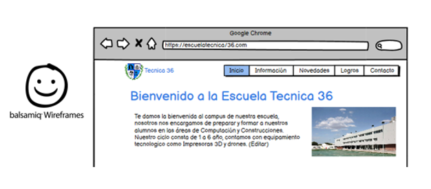

# Pagina Web de la Escuela
## Jackson Calderon
#### ET 36 DE 15 “Alte Guillermo Brown”
####  Proyecto Informático II
#### Buenos Aires, Argentina

##### Descripcion del proyecto
Es una pagina orientada especialmente a la Escuela, donde las personas se podran sentir mas cercanas a la institucion teniendo las ultimas novedades a su alcance.

##### ¿Como surge la idea/necesidad del proyecto?
La escuela si bien tiene las redes sociales como lo son Instagram o Facebook, en donde publican las novedades para que las personas puedan estar informadas, propongo desarrollar una pagina web propia de la escuela, con el mismo objetivo, mantener a las personas informadas y que aquellas familias que quieran sumarse a la escuela puedan tener una presentación más formal al establecimiento. 

##### Lista de Requerimientos
1. Respetar que la pagina web cumpla con el **Responsive** (Adaptación a las resoluciones de pantalla). 
Tarea Lograda
2.Realizar Navbar y diseñar la visualización de la sección Inicio. 
Tarea Lograda
3. Diseñar la visualización de la sección Información, Lograr el recorrido de la escuela mediante la técnica de Zigzag.
Tarea Lograda
4. Hacer que el Slider muestre correctamente cada una de las distintas diapositivas y que cambien al tocar las flechas laterales.
Tarea Lograda
5. Lograr que se muestren correctamente los recuadros y que el texto descriptivo se mantenga justificado de manera correcta.
Tarea Lograda
6. Lograr que después de llenar el formulario se envíe a algún mail.
No pude cumplir con este requisito debido a que, a la hora de enlazar el formulario con mi email, PHP detectaba errores y pese a que busque alguna

