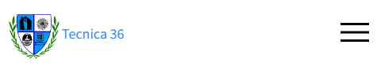
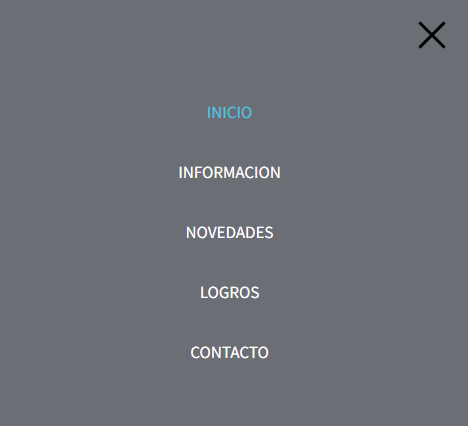

# Pagina Web de la Escuela
## Jackson Calderon
#### ET 36 DE 15 “Alte Guillermo Brown”
####  Proyecto Informático II
#### Buenos Aires, Argentina

##### Descripcion del proyecto
Es una pagina orientada especialmente a la Escuela, donde las personas se podran sentir mas cercanas a la institucion teniendo las ultimas novedades a su alcance.

##### ¿Como surge la idea/necesidad del proyecto?
La escuela si bien tiene las redes sociales como lo son Instagram o Facebook, en donde publican las novedades para que las personas puedan estar informadas, propongo desarrollar una pagina web propia de la escuela, con el mismo objetivo, mantener a las personas informadas y que aquellas familias que quieran sumarse a la escuela puedan tener una presentación más formal al establecimiento. 

##### Lista de Requerimientos
1. Respetar que la pagina web cumpla con el **Responsive** (Adaptación a las resoluciones de pantalla).
**Tarea Realizada**

2. Realizar Navbar y diseñar la visualización de la sección Inicio.
**Tarea Realizada**

3. Diseñar la visualización de la sección Información, Lograr el recorrido de la escuela mediante la técnica de Zigzag.
**Tarea Realizada**

4. Hacer que el Slider muestre correctamente cada una de las distintas diapositivas y que cambien al tocar las flechas laterales.
**Tarea Realizada**

5. Lograr que se muestren correctamente los recuadros y que el texto descriptivo se mantenga justificado de manera correcta.
**Tarea Realizada**

6. Lograr que después de llenar el formulario se envíe a algún mail.
**Tarea No Realizada**
No pude cumplir con este requisito debido a que, a la hora de enlazar el formulario con mi email, PHP detectaba errores y pese a que busque alguna solución, no pude lograr el objetivo.

##### ¿Como se armo el proyecto?
Lo primero que realice fue el boceto de mi pagina en la herramienta “Balsamiq Wireframes”, esto me permitió plasmar la idea que tenia en mi mente en un lugar que me ayudaría a que la misma tome forma, de esta manera si se me ocurría una nueva idea podía modificarlo y tenerlo listo para que yo pueda guiarme del boceto.

Luego de realizar este paso investigué maneras de lograr la idea que yo quería llevar a cabo y me encontré con cursos/videos que se asemejaban bastante al objetivo final, entre ellos noté que había distintas maneras de lograrlo una de ellas fue usar FlexBox que es un modulo de diseño de CSS que se encarga de facilitar el posicionamiento de los elementos reduciendo la cantidad de código, en pocas palabras, FlexBox es la capacidad de poder alterar, el ancho, alto y posicionamiento de los elementos de manera sencilla y tomando en cuenta el espacio con el que contamos.

Ademas de CSS Flexbox, encontre otra manera de elaborar algunas secciones de mi pagina, asi es estoy hablando de CSS Grid, que es un sistema de diseño que divide la pagina en una cuadricula, en la cual podremos posicionar los elementos que queramos de manera coherente y haciendo que los mismos tomen forma.

Para añadir pequeños detalles y animaciones en la pagina, ademas de utilizar JavaScript el cual me permitio realizar algunas transicciones, utilize los PseudoElementos que son los encargados de añadir estilos a una parte especifica de la pagina.

**PseudoElemento Animacion Navbar**

**JavaScript Transicciones**
  

